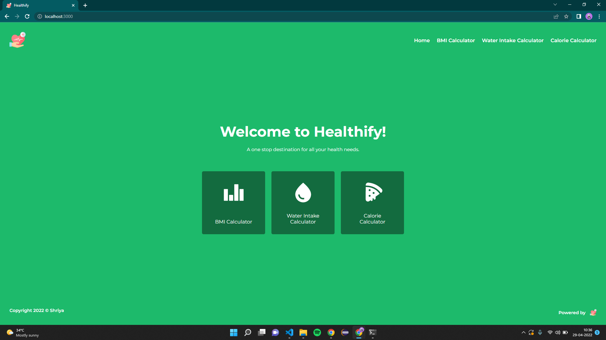
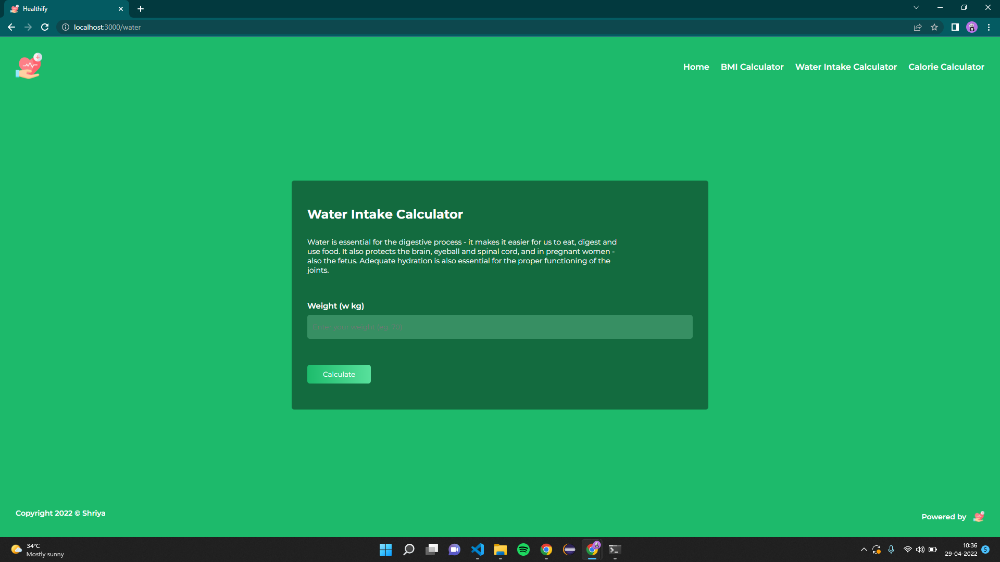
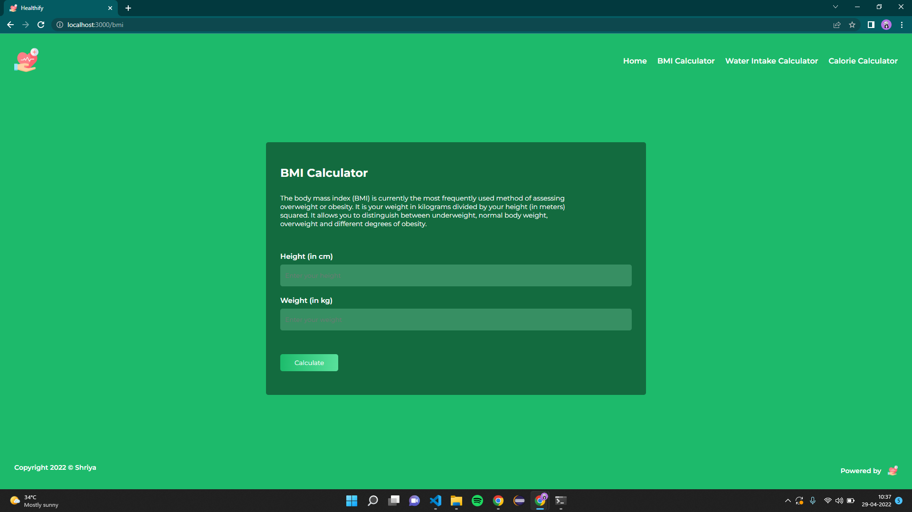
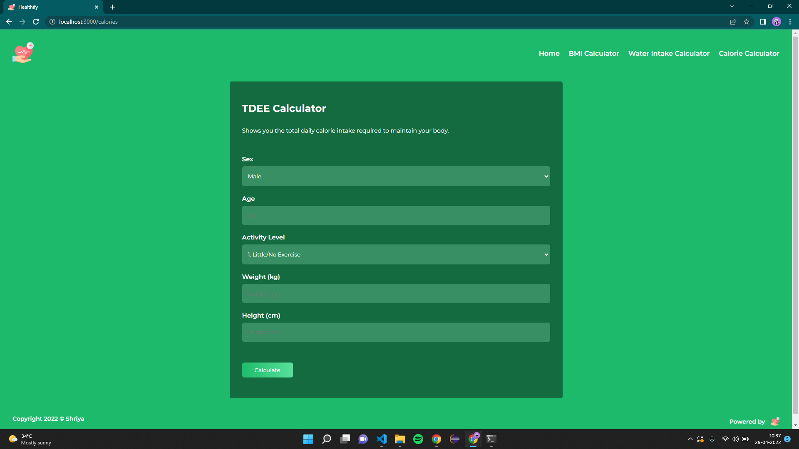

#  Healthify
## A one stop portal for managing your health needs.
Built Using ReactJs, the completely responsive web app consists of features like BMI calculator, Total Daily Energy Expenditure Calculator, and Daily Water Requirement for users.

## Instructions for starting the website:
<ol>
  <li> Please open the terminal and move into the Healthify directory. 
  <li> Install the required node modules using the command: “npm i”.
  <li> Start the React app by running the command: "npm start" </li>
  <li> Now you can test and explore the website in your favourite browser.</li>
</ol>

## Screenshots 

